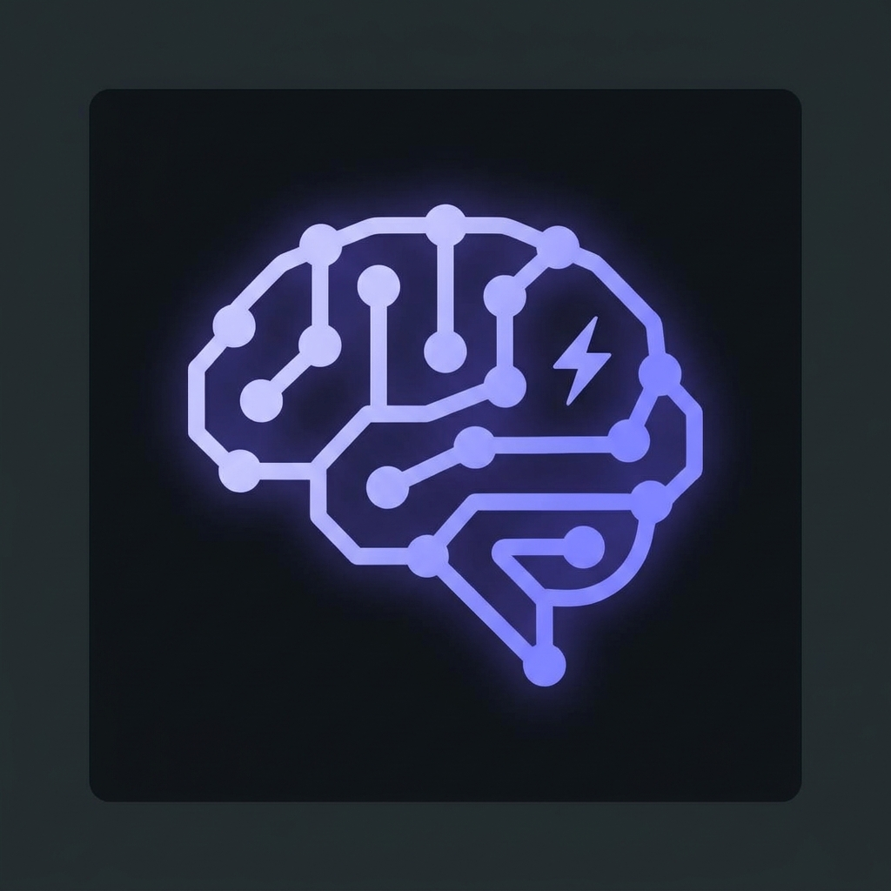

<div align="center">



# ⚡ Engram — Memory OS for Claude Code

### **The Persistent Memory Layer That Makes Claude Code Actually Remember**

[](https://code.visualstudio.com/)
[](https://www.typescriptlang.org/)
[](https://reactjs.org/)
[](LICENSE)

**Claude Code is amnesiac. Every session starts from zero.**<br/>
**Engram gives it a brain that persists across sessions, projects, and teams.**

[📖 Read the PRD](./Engram_PRD_v1.pdf) · [🎨 Design System](./DESIGN.md) · [🚀 Quick Start](#-quick-start) · [📸 Screenshots](#-screenshots)

</div>

---

## 🧠 What Is Engram?

Engram is a **VS Code extension** that creates a persistent memory layer for Claude Code. It silently:

1. **🔍 Indexes your codebase** — Detects stack, frameworks, components, functions, routes, and schemas
2. **📝 Records every session** — Extracts decisions, bug fixes, patterns, and warnings from git diffs
3. **💉 Injects context automatically** — At the start of every Claude Code session, relevant memories are injected into the system prompt

**Result:** Claude Code knows your project's conventions, remembers past bugs, and never asks "what framework are you using?" again.

---

## 🎬 The Problem

| Without Engram | With Engram |
|---|---|
| "What framework is this project using?" | Knows it's React 18 + TypeScript + Supabase |
| Re-explains the same DB schema every session | Remembers the schema and all migrations |
| Repeats a bug fix you explained 3 sessions ago | Has the bug fix stored with file references |
| Token budget wasted on project context | 2000-token compressed context auto-injected |
| New team member starts from zero | Import `.engram` file for instant onboarding |

---

## 🚀 Quick Start

### Install from VSIX

```bash
# Clone the repo
git clone https://github.com/Abhion24/EngRam.git
cd Engram

# Install dependencies
npm install
cd dashboard && npm install && cd ..

# Build everything
node esbuild.config.mjs --production
cd dashboard && npx vite build && cd ..

# Package the extension
npx @vscode/vsce package --no-dependencies

# Install in VS Code
code --install-extension engram-1.0.0.vsix
```

### First Run

1. Open any project in VS Code
2. **⚡ Engram activates automatically** — look for `$(brain) Engram` in the status bar  
3. First time? It auto-indexes your codebase (progress shown in notification)
4. Click the status bar or run `Ctrl+Shift+P` → `Engram: Open Memory Dashboard`
5. Dashboard opens at **http://localhost:6173** with your real project data

---

## 📸 Screenshots

<div align="center">

### Dashboard — System Overview


### Memories — Search, Filter, Pin


### Context Preview — Token Budget Visualization  


### Settings — Full Configuration


</div>

---

## 🏗️ Architecture

```
Developer opens VS Code
    ↓
Engram activates → detects project → indexes codebase
    ↓
Claude Code session starts → Engram injects relevant context (2000 tokens)
    ↓
Developer works with Claude → Engram watches file changes
    ↓
Session ends → Engram analyzes git diffs → extracts memories via Claude API
    ↓
Next session starts smarter than the last
```

### Three Memory Layers

| Layer | How It Works |
|-------|-------------|
| **🔍 Codebase Indexer** | Scans project files, extracts functions/components/routes/schemas, detects stack from `package.json` |
| **📝 Session Recorder** | Watches file changes during Claude Code sessions, analyzes git diffs, extracts decisions via Claude Sonnet |
| **💉 Context Injector** | Retrieves pinned + recent + semantically relevant memories, compresses to token budget, injects into system prompt |

### Zero Native Dependencies

No Python. No ChromaDB. No `better-sqlite3`. Engram uses **pure JavaScript** — JSON file storage + cosine similarity vector search. Install once, works everywhere.

---

## 📋 VS Code Commands

| Command | Description |
|---------|-------------|
| `Engram: Open Memory Dashboard` | Opens the web dashboard at localhost:6173 |
| `Engram: Index Codebase` | Force re-index the current project |
| `Engram: Show Memory Count` | Shows memory count + health score |
| `Engram: Export Memories (.engram)` | Save all memories as a portable file |
| `Engram: Import Memories (.engram)` | Load a teammate's memory file for instant onboarding |
| `Engram: Clear All Memories` | Delete all memories (with confirmation) |

---

## ⚙️ Configuration

| Setting | Default | Description |
|---------|---------|-------------|
| `engram.claudeApiKey` | `""` | Your Anthropic Claude API key |
| `engram.tokenBudget` | `2000` | Max tokens injected into Claude's context |
| `engram.confidenceThreshold` | `0.6` | Min confidence for memory injection (0.0-1.0) |
| `engram.autoIndex` | `true` | Auto-index codebase on first open |
| `engram.enableSessionRecording` | `true` | Auto-extract memories from sessions |
| `engram.dashboardPort` | `6173` | Port for the web dashboard |
| `engram.memoryDecayDays` | `30` | Days before unpinned memories lose relevance |

---

## 🎨 Design System

Engram uses **"The Cognitive Loom"** design philosophy:

- **Hyper-Functional Stoicism** — Every pixel serves a purpose
- **No-Line Philosophy** — Zero borders for separation; tonal shifts only
- **Ghost Shadows** — Depth without visible edges
- **Luminous Indigo** (`#C0C1FF`) — Primary accent against deep dark surfaces
- **Inter** — Exclusive typeface at dense 1.25 line-height

Full design tokens documented in [`DESIGN.md`](./DESIGN.md).

---

## 📁 Project Structure

```
ENGRAM/
├── src/
│   ├── extension.ts           # VS Code extension entry point
│   ├── api/claudeApi.ts       # Claude API wrapper + local embeddings
│   ├── memory/
│   │   ├── memoryTypes.ts     # TypeScript interfaces
│   │   ├── memoryStore.ts     # JSON-backed memory CRUD
│   │   └── vectorStore.ts     # Pure JS cosine similarity search
│   ├── indexer/
│   │   └── codebaseIndexer.ts # AST parsing + stack detection
│   ├── session/
│   │   ├── sessionRecorder.ts # File watcher + memory extraction
│   │   └── diffAnalyzer.ts    # Git diff parsing
│   ├── context/
│   │   ├── contextInjector.ts # Context building + dedup
│   │   └── tokenBudget.ts     # Token counting + compression
│   └── server/
│       └── dashboardServer.ts # Express REST API (14 endpoints)
├── dashboard/
│   └── src/
│       ├── App.tsx            # Root with sidebar + routing
│       ├── styles/globals.css # Complete "Cognitive Loom" design system
│       └── pages/             # Dashboard, Memories, Sessions, Context, Settings
├── package.json               # VS Code extension manifest
├── DESIGN.md                  # Full design system documentation
├── Engram_PRD_v1.pdf          # Product Requirements Document
└── LICENSE                    # MIT License
```

---

## 🤝 Team Onboarding

Engram's `.engram` export format makes team onboarding instant:

```bash
# Senior developer exports their memory
# VS Code → Ctrl+Shift+P → "Engram: Export Memories"
# → Saves to project-name.engram

# New developer imports it
# VS Code → Ctrl+Shift+P → "Engram: Import Memories"
# → Instantly has all project conventions, patterns, and known bugs
```

---

## 🔮 Roadmap

- [ ] VS Code Marketplace publishing
- [ ] Multi-model support (GPT-4, Gemini)
- [ ] Team memory sync via cloud
- [ ] Memory graph visualization
- [ ] CLAUDE.md auto-generation from memories
- [ ] Git hook integration for automatic session recording

---

## 📄 License

MIT License — see [LICENSE](./LICENSE)

---

<div align="center">

**Built by [Abhi Khade](https://github.com/AbiKhade)** • Opus 4.7 Hackathon • April 2026

⭐ Star this repo if Engram saved you from explaining your project again!

</div>
